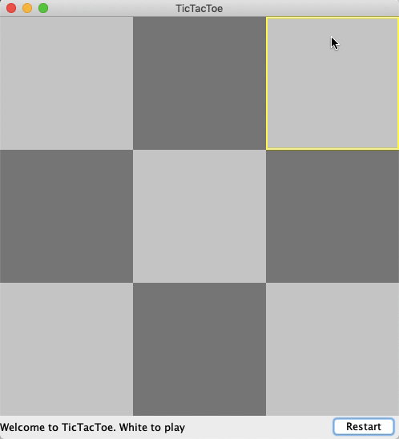

# TicTacToeGame

This is a program that implements a simple TicTacToe Game using Java and the Swing GUI Toolkit.

## Background Information 
> Tic-tac-toe (American English), noughts and crosses (Commonwealth English), or Xs and Os is a paper-and-pencil game for two players, X and O, who take turns marking the spaces in a 3×3 grid. The player who succeeds in placing three of their marks in a horizontal, vertical, or diagonal row is the winner. 
**Source: [Wikipedia](https://en.wikipedia.org/wiki/Tic-tac-toe).**

## Demo 

## Areas of Improvement

- [ ] __(Bug)__ Grid Pattern only appears after mouse has hovered over all boxes.
